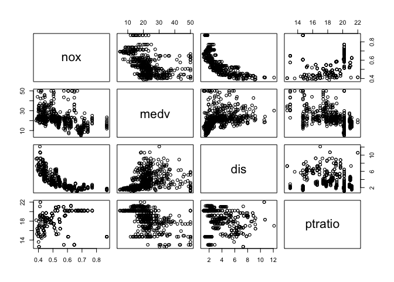

Predicting Boston Housing Prices with Machine Learning
================
Timothy Pace
July 26, 2018

Preprocessing & EDA
-------------------

``` r
boston <- read.csv("Boston.csv")

boston <- boston[,c('nox', 'medv', 'dis', 'ptratio')]
plot(boston)
```



It appears that home value is tightly related to NO concentration, as well as distance to work and student to teacher ratio.

1.  Fit single linear regressions with medv as the outcome and each of the predictors:

``` r
mod1 <- lm(medv ~ nox, data = boston)
summary(mod1)
```

    ## 
    ## Call:
    ## lm(formula = medv ~ nox, data = boston)
    ## 
    ## Residuals:
    ##     Min      1Q  Median      3Q     Max 
    ## -13.691  -5.121  -2.161   2.959  31.310 
    ## 
    ## Coefficients:
    ##             Estimate Std. Error t value Pr(>|t|)    
    ## (Intercept)   41.346      1.811   22.83   <2e-16 ***
    ## nox          -33.916      3.196  -10.61   <2e-16 ***
    ## ---
    ## Signif. codes:  0 '***' 0.001 '**' 0.01 '*' 0.05 '.' 0.1 ' ' 1
    ## 
    ## Residual standard error: 8.323 on 504 degrees of freedom
    ## Multiple R-squared:  0.1826, Adjusted R-squared:  0.181 
    ## F-statistic: 112.6 on 1 and 504 DF,  p-value: < 2.2e-16

``` r
mod2 <- lm(medv ~ dis, data = boston)
summary(mod2)
```

    ## 
    ## Call:
    ## lm(formula = medv ~ dis, data = boston)
    ## 
    ## Residuals:
    ##     Min      1Q  Median      3Q     Max 
    ## -15.016  -5.556  -1.865   2.288  30.377 
    ## 
    ## Coefficients:
    ##             Estimate Std. Error t value Pr(>|t|)    
    ## (Intercept)  18.3901     0.8174  22.499  < 2e-16 ***
    ## dis           1.0916     0.1884   5.795 1.21e-08 ***
    ## ---
    ## Signif. codes:  0 '***' 0.001 '**' 0.01 '*' 0.05 '.' 0.1 ' ' 1
    ## 
    ## Residual standard error: 8.914 on 504 degrees of freedom
    ## Multiple R-squared:  0.06246,    Adjusted R-squared:  0.0606 
    ## F-statistic: 33.58 on 1 and 504 DF,  p-value: 1.207e-08

``` r
mod3 <- lm(medv ~ ptratio, data = boston)
summary(mod3)
```

    ## 
    ## Call:
    ## lm(formula = medv ~ ptratio, data = boston)
    ## 
    ## Residuals:
    ##      Min       1Q   Median       3Q      Max 
    ## -18.8342  -4.8262  -0.6426   3.1571  31.2303 
    ## 
    ## Coefficients:
    ##             Estimate Std. Error t value Pr(>|t|)    
    ## (Intercept)   62.345      3.029   20.58   <2e-16 ***
    ## ptratio       -2.157      0.163  -13.23   <2e-16 ***
    ## ---
    ## Signif. codes:  0 '***' 0.001 '**' 0.01 '*' 0.05 '.' 0.1 ' ' 1
    ## 
    ## Residual standard error: 7.931 on 504 degrees of freedom
    ## Multiple R-squared:  0.2578, Adjusted R-squared:  0.2564 
    ## F-statistic: 175.1 on 1 and 504 DF,  p-value: < 2.2e-16

What are the associations of NO, distance to employment, and education with home value?
---------------------------------------------------------------------------------------

Higher concentrations of NO are associated with decreased or lower home values (-33.92). For every NO increase by 1 part per million, home price goes down by about $34000. Greater distances to work are associated with increased or higher home values (1.09). For every increase by 1 kilometer in distance to work, home value goes up by about $1000. Lower ratios of teachers to students are associated with decreased or lower home values (-2.157). For every added student per teacher, home value decreases by about $2000.

Which predictor explains the data the best?
-------------------------------------------

Student to teacher ratio as a predictor of home values has the the highest adjusted r-squared value (0.26), and thus it explains the data the best.

Runs a multiple linear regression with median housing price as the outcome and the other three variables as the predictors:
---------------------------------------------------------------------------------------------------------------------------

``` r
mod.full <- lm(medv ~ dis + nox + ptratio, data = boston)
summary(mod.full)
```

    ## 
    ## Call:
    ## lm(formula = medv ~ dis + nox + ptratio, data = boston)
    ## 
    ## Residuals:
    ##     Min      1Q  Median      3Q     Max 
    ## -12.434  -4.931  -1.270   2.951  32.606 
    ## 
    ## Coefficients:
    ##             Estimate Std. Error t value Pr(>|t|)    
    ## (Intercept)  89.0255     4.2358  21.017  < 2e-16 ***
    ## dis          -1.2803     0.2374  -5.393 1.07e-07 ***
    ## nox         -44.7740     4.2729 -10.479  < 2e-16 ***
    ## ptratio      -1.9939     0.1503 -13.270  < 2e-16 ***
    ## ---
    ## Signif. codes:  0 '***' 0.001 '**' 0.01 '*' 0.05 '.' 0.1 ' ' 1
    ## 
    ## Residual standard error: 7.109 on 502 degrees of freedom
    ## Multiple R-squared:  0.4061, Adjusted R-squared:  0.4026 
    ## F-statistic: 114.4 on 3 and 502 DF,  p-value: < 2.2e-16

### Interpretation

Surprisingly, by controlling for NO and student teacher ratio, home prices decrease the farther you live from work in Boston. In other words, when controling for air pollution and student to teacher ratio, greater distances to work are associated with lower home values. This may be because living closer to work is more convenient, and the price of this convenience is higher home values.

### Which model fits the data the best?

The adjusted r-squared value for the multivariate model is the highest at .40, and therefore fits the data best compared to all the single linear regression values (the highest of which is .26 for student to teacher ratio). Therefore, because the multivariate model explains the most variation in the data, it fits the data the best.

### Predicts and finds the prediction interval the median home value of a home 3 km from work, with a NO concentration of 0.35, and a student-teacher ratio of 10.

``` r
predict(mod.full, newdata=data.frame("dis" = 3, "nox" = 0.35, "ptratio" = 10), interval="prediction")
```

    ##        fit      lwr      upr
    ## 1 49.57499 35.22737 63.92261

The prediction interval of median home value when a home is 3 km from work, has a NO concentration of 0.35, and a student-teacher ratio of 10 is 49.57 (about $50000) with a lower bound of 35.23 (about $35000) and an upper bound of 63.92 (about $64000). 4
